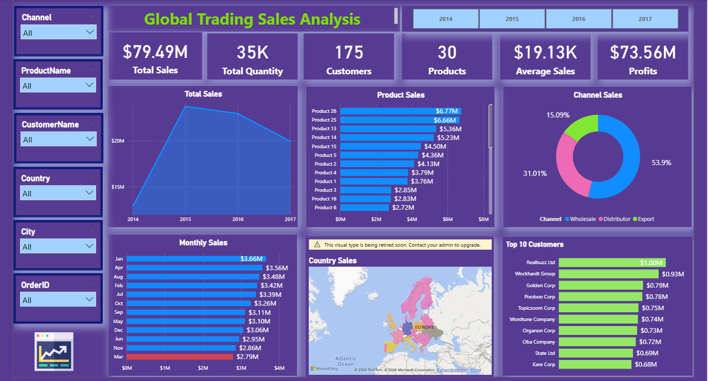
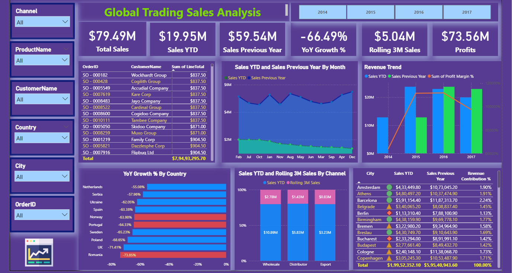

## 🌍 Global Trading Sales Analysis Dashboard (Power BI + SQL Project)

## 📌 Project Overview
This project focuses on analyzing **global trading sales performance** across multiple countries, customers, products, and sales channels.

Using **SQL + Power BI**, an interactive dashboard was developed to track:

* Total Sales & Profit Trends
* Customer & Product Performance
* Channel Contribution (Wholesale, Distributor, Export)
* Year-over-Year Growth
* Regional & Country-level Sales Insights

This dashboard helps businesses understand revenue drivers and optimize global sales strategies.

---

## 🎯 Project Objective
The main goals of this project are:

* Build a relational database using SQL Server
* Clean and transform raw data using Excel & Power Query
* Establish primary & foreign key relationships
* Monitor total sales, quantity, and profit across years
* Identify top-performing products and customers
* Analyze sales contribution by channel
* Track YoY Growth and Rolling Sales performance
* Support data-driven decision-making for global expansion

---

## 📂 Dataset Information -->>>>

* **Source** : SQL Dataset.xlsx
* **File Used** :
Customers.csv  
Orders.csv
Products.csv
Regions.csv 

🔗 **[View Excel Dataset](https://github.com/dimple-shah-au13/Global-Trading-Sales-Analysis/blob/main/SQL%20Dataset.xlsx)**

🔗 **[View Customers Dataset](https://github.com/dimple-shah-au13/Global-Trading-Sales-Analysis/blob/main/Customers.csv )**

🔗 **[View Orders Dataset](https://github.com/dimple-shah-au13/Global-Trading-Sales-Analysis/blob/main/Orders.csv )**

🔗 **[View Products Dataset](https://github.com/dimple-shah-au13/Global-Trading-Sales-Analysis/blob/main/Products.csv )**

🔗 **[View Regions Dataset](https://github.com/dimple-shah-au13/Global-Trading-Sales-Analysis/blob/main/Regions.csv )**

### Key Columns Included

* OrderID  
* CustomerName  
* ProductName  
* Country / City  
* Channel (Wholesale, Distributor, Export)  
* SalesAmount  
* Quantity Sold  
* Profit

## 🛠 Tools & Technologies Used

| Tool               | Purpose |
|--------------------|---------|
* SQL Server / MySQL | Data extraction & querying |
* Power BI           | Dashboard building & visualization |
* Power Query        | Data cleaning & transformation |
* DAX Measures       | KPI calculations |
* Excel Dataset      | Source file |

## 🏗 Database Design (MySQL Server)

Created normalized tables:
Customers
Products
Regions
Orders
Defined Primary Keys and Foreign Keys
Ensured referential integrity

## 🛢️ SQL Queries Used

🔗 **[View All Queries](https://github.com/dimple-shah-au13/Global-Trading-Sales-Analysis/blob/main/Queries.sql)**

## 🔹 Total Sales by Product
## 🔹 Sales by Region 
## 🔹 Top 10 Products

## 🔄 Data Cleaning & Transformation (Power Query)

Dataset was cleaned and normalized before analysis.
# 🧹 Data Cleaning Steps :

# 🏙️ Cleaning the City Column (Region Table) :
1. Select the City Column
Open the Region Table and click on the City column.
2. Trim Extra Spaces (Always First)
Removed unwanted leading/trailing spaces.
3. Convert Text to Proper Case
Standardized city names for readability.
4. Remove Text Inside Brackets
Some city values contained extra information like:
Berlin (Germany)
Paris (France)
To clean this, conditional logic was applied using a Custom Column.
➕ Add Custom Column

Power Query Formula:

if Text.Contains([City], "(") 
then Text.BetweenDelimiters([City], "(", ")") 
else [City]

📌 Column Name: CleanCity

if Text.Contains([FullName], "(") then
    Text.BetweenDelimiters([FullName], "(", ")")
    & ", "
    & Text.AfterDelimiter([FullName], ",")
else
    [FullName]

5. Remove Original Column
6. Standardize Incorrect City Spellings
Example:

Lã³Dz            Lodz
Krakã³W          Krakow
Dã¼Sseldorf      Dusseldorf
Mã¡Laga          Malaga

# 👤 Cleaning the CustomerName Column (Customers Table) :

1. Trim Extra Spaces
2. Capitalize Each Word
3. Remove Duplicate Customers

# 📅 Cleaning the Date Column (Orders Table)

1. Convert Data Type to Date Format
Corrected incorrect datatype for proper time analysis.

## 🧩 Data Modeling in Power BI 
✔ Cardinality: One-to-Many

## ➕ Creating New Calculated Columns 

📌 Profit = 'salesdb orders'[LineTotal] - 'salesdb orders'[TotalUnitCost]

📌 Profit Margin % =
DIVIDE(
    SUM('salesdb orders'[Profit]),
    SUM('salesdb orders'[LineTotal]),
    0
)

## 🧮 DAX Measures Used

📌 **Average Sales** = AVERAGE('salesdb orders'[LineTotal])

📌 **Avg Sales Per Customer** = SUM('salesdb orders'[LineTotal])/DISTINCTCOUNT('salesdb customers'[CustomerID])

📌 **Total Sales** = SUM('salesdb orders'[LineTotal])

📌 **Total Quantity** = SUM('salesdb orders'[Quantity])

📌 **Revenue Contribution %** = DIVIDE([Total Sales], CALCULATE([Total Sales],ALL('salesdb products'),ALL('salesdb customers'),ALL('salesdb regions')))

📌 **Sales YTD** = TOTALYTD(SUM('salesdb orders'[LineTotal]),'salesdb orders'[OrderDate]) 

📌 **Sales Previous Year** = CALCULATE(SUM('salesdb orders'[LineTotal]), DATEADD('salesdb orders'[OrderDate], -1, YEAR))

📌 **Date Table** = 

ADDCOLUMNS(
    CALENDAR(MIN('salesdb orders'[OrderDate]), MAX('salesdb orders'[OrderDate])),
    "Year", YEAR([Date]),
    "Month Number", MONTH([Date]),
     "Month Name", FORMAT([Date], "MMM"),
     "Quarter",  "Q" &  FORMAT([Date], "Q")
) 

📌 **YoY Growth %** = 
DIVIDE([Sales YTD] - [Sales Previous Year], [Sales Previous Year], 0)

📌 **Rolling 3M Sales** = 

CALCULATE(
    SUM('salesdb orders'[LineTotal]),
    DATESINPERIOD('Date Table'[Date],MAX('Date Table'[Date]), -3, MONTH)
) 

---

# 📊 Dashboard 1: Key_Insights

## 🔑 Key Performance Indicators (KPIs)

The dashboard highlights major business KPIs:

- 💰 **Total Sales:** $79.49M  
- 📦 **Total Quantity Sold:** 35K  
- 👥 **Total Customers:** 175  
- 🏷 **Total Products:** 30  
- 📈 **Average Sales:** $19.13K  
- 💵 **Total Profit:** $73.56M  

## 📈 Dashboard Visuals & Insights

1️⃣ Total Sales Trend (2014–2017)

**Visual**: Line / Area Chart
**Metrics**: Total Sales by Year

**Insights**:
* Sales peaked sharply in **2015**, showing the strongest yearly performance
* Slight decline observed after 2016, indicating slowing growth
* Overall sales remained strong across all 4 years

2️⃣ Top Products by Sales

**Visual**: Horizontal Bar Chart
**Metrics**: Sales Amount by Product

**Insights**:
* Product 26 is the top-selling product with $6.77M revenue
* Top 10 products contribute a major portion of total sales
* Product sales distribution highlights high dependency on bestsellers

3️⃣ Channel-wise Sales Contribution

**Visual**: Donut / Pie Chart
**Metrics**: Sales Share by Channel

**Insights**:
* Wholesale channel dominates with ~54% revenue contribution
* Distributor and Export channels contribute smaller shares
* Channel diversification opportunities exist for balanced growth

4️⃣ Monthly Sales Distribution

**Visual**: Stacked Bar Chart
**Metrics**: Sales by Month

**Insights**:
* Monthly sales remain consistent across the year
* Certain months show stronger spikes indicating seasonal demand
* Helps identify peak-selling periods for planning inventory

5️⃣ Country Sales Map

**Visual**: Filled Map Chart
**Metrics**: Sales by Country

**Insights**:
* Sales are widely distributed across European regions
* Certain countries contribute more heavily to global revenue
* Regional expansion opportunities can be identified

6️⃣ Top 10 Customers by Sales

**Visual**: Stacked Bar Chart
**Metrics**: Total Sales by Customer

**Insights**:
* A few customers contribute significantly to overall revenue
* Customer concentration risk is visible
* High-value customers can be targeted for retention strategies

---

# 📊 Dashboard 2: Performance_Insights

## 🔑 Key Performance Indicators (KPIs)

The dashboard highlights major business KPIs:

- 💰 **Total Sales:** $79.49M  
- 📊 **Sales YTD:** $19.95M
- 📈 **Sales Previous Year:** $59.54M   
- 🔄 **Rolling 3M Sales:** $5.04M  
- 📉 **YoY Growth %:** -66.49% 
- 💵 **Total Profit:** $73.56M  

## 📈 Dashboard Visuals & Insights

7️⃣ Sales YTD vs Previous Year Trend

**Visual**: Area Chart
**Metrics**: Sales YTD vs Sales Previous Year

**Insights**:
* Sales performance fluctuates across months
* Comparison shows weaker momentum in later years
* Useful for tracking current year progress against benchmarks

8️⃣ YoY Growth % by Country

**Visual**: Stacked Bar Chart
**Metrics**: Year-over-Year Growth Percentage

**Insights**:
* YoY growth declined significantly in 2017
* Portugal and Romania recorded the largest sales drop
* Indicates regions requiring business recovery strategies

9️⃣ Rolling 3-Month Sales by Channel

**Visual**: 100% Stacked Column Chart
**Metrics**: Rolling 3M Sales by Channel

**Insights**:
* Distributor channel maintains stable rolling sales performance
* Wholesale continues to lead in long-term contribution
* Rolling metrics smooth out seasonality effects

🔟 Revenue Trend

**Visual**: Line and Clustered Column Chart
**Metrics**: 
Sales YTD vs Sales Previous Year
Profit Margin % over Years

**Insights**:
* Profit margin shows variations alongside revenue trends
* Helps track business efficiency and cost control
* Supports profitability-focused decision-making

1️⃣1️⃣ Revenue Contribution by City

**Visual**: Matrix Table
**Metrics**: 
City
Sales YTD
Sales Previous Year
Revenue Contribution %

**Insights**:
* Major cities contribute the highest share of revenue
* City-wise segmentation helps optimize local sales strategies
* Highlights top-performing urban markets

1️⃣2️⃣ Sales Trends by Customers

**Visual**: Matrix Table
**Metrics**:
OrderID 
CustomerName
SalesAmount

**Insights**:
* The matrix helps identify high-value customers generating the largest sales volumes
* Multiple orders from the same customer indicate repeat purchase behavior and strong loyalty
* A few customers contribute a significant portion of total revenue, showing customer concentration risk
* Order-level breakdown supports drill-down analysis to track individual transactions and buying patterns
*  Useful for detecting bulk purchases, premium buyers, and potential key accounts for retention strategiess

---

## 🎛 Filters & Interactivity

* Channel
* ProductName
* CustomerName
* Country
* City
* OrderID
* Year
* Cross-filtering across all visuals

## 📷 Dashboard Interaction -->>>>

🔗 **[View Raw Global Trading Sales Analysis Dashboard](https://github.com/dimple-shah-au13/Global-Trading-Sales-Analysis/blob/main/Sales%20Analysis%20-%20SQL%20Project.pbix)**

## 🔍 Business Recommendations

* Improve Export channel performance through targeted marketing
* Focus on high-value customers contributing maximum revenue
* Investigate declining YoY growth after 2016
* Expand operations in top-performing countries and cities

## 📷 Dashboard Preview  

Here’s a preview of the interactive dashboard:

## 🚀 How to Use This Project

Download the dataset file
Open Power BI dashboard file (.pbix)
Load dataset into Power BI
Refresh the report
Use slicers to explore insights 

## 👩‍💻 Author

**Dimple Shah**
- Data Analyst | Excel | Power BI | Tableau | SQL | Python | Business Intelligence Enthusiast

## GITHUB -->>>>

🔗 <a href ="https://github.com/dimple-shah-au13/Global-Trading-Sales-Analysis/tree/main">GITHUB</a>

## ⭐ Support

If you like this project, don’t forget to ⭐ star the repository on GitHub!